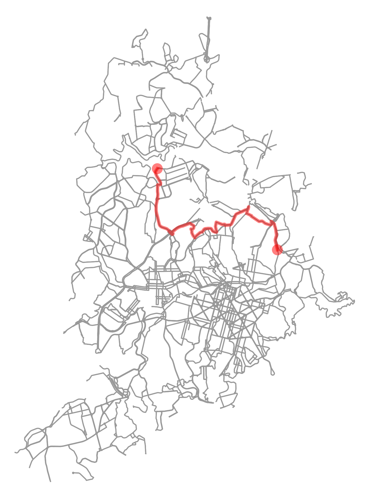
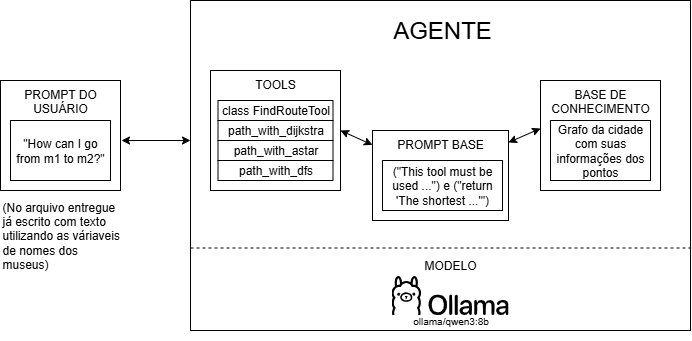

# Museum Route Agent
Agente conversacional que informa rotas entre diferentes pontos de Belo Horizonte, tendo como seu alvo principal os diversos museus da cidade. 
Realizado como Trabalho Prático 1 da disciplina de Introdução à Inteligência Artificial da UFMG em 2025/1.

O problema proposto foi a implementação de um agente conversacional, utilizando a biblioteca smolagents, que seja capaz de interagir com o mundo a partir de um grande modelo de linguagem (Large Language Model - LLM). 

O agente apresentado em questão tem como objetivo informar rotas entre diferentes pontos de Belo Horizonte, tendo como seu alvo principal os diversos museus da cidade.

- Documentação disponível em  [documentacao.pdf](./auxiliares/documentacao.pdf)
- Enunciado em [Enunciado.pdf](./auxiliares/Enunciado_TP1_2025.pdf)

## Objetivos e funcionalidades principais:

- Obtenção e utilização do grafo da cidade de Belo Horizonte
- Uso de algoritmos de busca para encontrar os caminhos
- Execução do Agente de forma local, com modelo ollama_chat/qwen3:8b e utilizando Tools definidas
- Impressão da rota obtida em figura .png

   Imagem: Rota entre "Museu de História Natural da UFMG" e "Casa Kubitschek"

## Arquitetura
  

## Exemplo de execução
  

